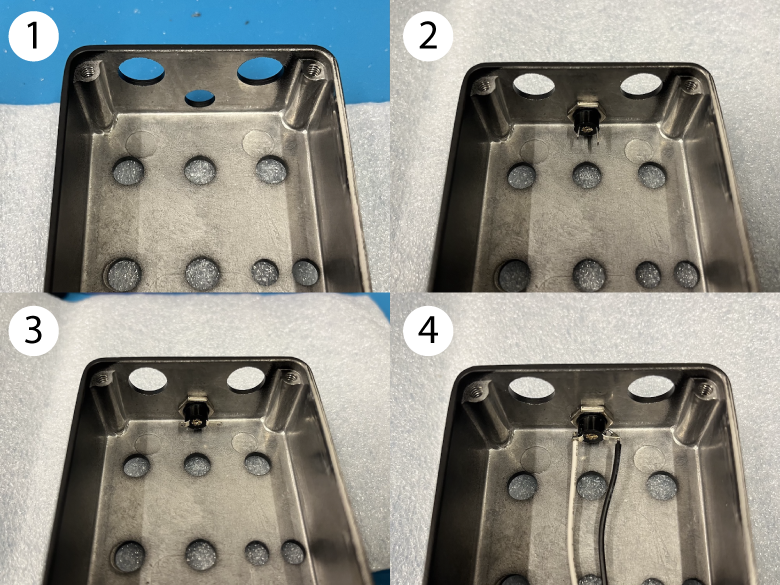

# THT Parts
## Parts for PCB:
- 2x JST PH 2.0mm connectors [P1, SW3]
- 1x EC2-5SNU/5SNJ relay [RLY1]
- 1x short wire [P9] (for ground to jacks)
- 2x long wires [P2, P5] (for signal to jacks)
  - use small rectangular pads on the JST-style footprints.

## Controls, Jacks, etc:
- black DC jack w/ harness
  - bend pins outward before adding harness, otherwise 100kB pot won’t fit.
  - connect harness to [P1] JST connector.
- 1x 25kB pot [RV2]
- 1x 100kB pot [RV4]
- 3x 100kA pot [RV1, RV3, RV5]
- 1x SPST ON-OFF-ON toggle [SW1]
- 1x DPDT ON-ON toggle [SW2]
- 1x LED yellow [D2]
  - long leg to square pad (hole).
- 1x SPST NO footswitch w/ harness
  - connect harness to [SW3] JST connector.
- 2x black audio jack 1/4"
  - connector to wires from [P9, P2, P5].
  - ground wire [P9] is soldered to angled-corner pin on jack.

# Step by Step: PCB
The circuitboard should already have all surface-mount (SMT) parts soldered in place, thanks to some helpful robots in Hatfield, PA.
But a handful of through-hole (THT) parts and wires need to be soldered into place before the pedal can be assembled.
With THT parts, it's recommended to solder them from shortest to tallest. This allows the PCB to be flipped over to hold the parts in place against the table — no extra "hands" required.
### 1. First, solder the two white JST connectors into place at P1 and SW3.
These allow the harness wires from the power jack and footswitch to connect to the PCB. The orientation of the connector should be indicated by the design on the PCB. The connector's legs should be placed in the smaller set of holes (the larger holes were added only as a backup).
### 2. Next, solder the EC2 relay in place at RLY1.
These orange boxes have a polarity, but luckily they only fit into the PCB in one direction. This component is fairly expensive, so extra care should be taken not to damage it accidentally with the side of the iron while soldering other parts later on.
### 3. Last, solder the wires to the PCB.
The wire's white insulation is trimmed on both sides, but one side has more of the internal conductor exposed. Insert the shorter side into the PCB.
The short wire should be soldered to [P9]. The long wires should be soldered to the small, square holes on [P2] and [P5].
With all of that finished, the PCB is now ready for the next part of the assembly process.
# Step by Step: Enclosure
### 1. First, add the black DC jack.
1. It's best to start with an empty enclosure.
The pins on the DC jack must be bent in order to make space for the "contour" pot. Here's how to do it without damaging the jack or the rest of the pedal:
2. Insert the DC jack. then add the nut and tighten it so the jack remains in place.
Next, use a pair of pliers to bend the solder lugs outwards. the lug is the bit of metal with a hole in it, designed for a wire to fit through.
3. It works best to grab the solder lug close to the jack. bend it at a sharp angle so it remains straight after the bend.
4. Last, solder the connector wire to the jack.
On the current version, solder the black wire to the longer solder lug.

### 2. Next, fit the SPST footswitch.
Make sure the footswitch has a JST harness soldered in place before adding it to the pedal.
Remove the first nut and washer, leaving the second nut in place (screwed in fully). Insert the footswitch, then screw it in place with the nut and washer that you removed.
With the DC jack and footswitch in place, it's now time to add the PCB and other controls. But first, these controls should be placed onto the PCB. However, they should NOT be soldered yet.
### 3. Prepare the pots.
Before adding any potentiometers to the PCB, make sure that the "stability tabs" on each is removed. These tabs should not be removed by cutting, as they are fairly thick. Instead, they can be very easily removed by bending them to the side. To do this, hold the pot in place with one hand, and with the other hand use a pair of pliers to grab the tab by its wider sides. Next, turn your wrist as if opening a round doorknob, and the tab should "pop" off of the pot fairly easily.
The 100kB pot additionally needs a plastic "dust cover" to be added. This helps to insulate it in case the DC jack comes loose. The top edge of the dust cover has a notch along about one third of its diameter. This notch should be aligned to go beneath the "legs" of the pot. To add the dust cover, push it partway onto the pot by hand, making sure that the alignment of the notch is correct. Once you've done that, you can use a pair of pliers to push it fully into place. It should fit snugly.
### 4. Put the pots in place (do NOT solder).
Once the pots are prepared, you can fit them in place on the PCB. The three 100kA pots [RV1, RV3, RV5] are identical and interchangeable. But extra care should be taken to ensure that the 25kB pot [RV2] and 100kB pot [RV4] are in the correct spots.
### 5. Fit the DPDT and SPDT toggle switches onto the PCB (do NOT solder).
This type of switch has a "notch" along one side of the threaded metal shaft. The switches should be fitted so the notches on both are facing towards the top edge of the PCB. This has no functional significance, it simply adds a visual consistency to the pedal.
There's one extra consideration with the switches on the Oxford Drive in particular. Since the SPDT switch is so close to the enclosure's edge, sometimes the hex nut on the switch will push against the edge and prevent the switch from fully pushing into place. To prevent this, make sure that the hex nut is turned to have a totally flat edge along the side of the switch that lines up to the edge of the PCB.
### 6. Last, fit the yellow LED in place on the PCB.
LEDs have a polarity and must be placed in the correct orientation. The LED's cathode should be placed in the square pad on the PCB. Check out this [led polarity diagram](img/led-polarity-diagram-20240328-2.png) for more info.
### 7A. If the pots, switches, and LED are all in place, then the PCB can now be fitted into the enclosure.
This step can be surprisingly difficult at first, as all of the slightly loose controls must be nudged through their respective holes. I recommend pushing the upper row of controls partway through first, which usually allows the bottom row to slot into place more easily.
Once the controls are flush with the inside fade of the enclosure, they need to be secured in place. Use one hand to hold the PCB and enclosure simultaneously, to prevent the PCB or controls from falling out. I recommend holding the PCB in place with the index finger while using the thumb and other fingers to hold the enclosure. With the other hand, add nuts and washers to each of the controls. The toggle switches require a single hex nut. The pots require a hex nut and a washer. The nuts should be screwed on fully to ensure that the controls fit right, but they don't need to be tightened yet.
### 7B. Check to ensure the PCB is fitted correctly.
Once you've added the nuts, check to make sure the PCB is even and parallel to the face of the enclosure (the part of the enclosure with the control labels). The PCB can be just a little slanted, since the depth of the switches are slightly different from the pots. But it should only be a very small slant at most. The main cause of a slanted PCB is when a stability pin was accidentally left on a pot, although sometimes it's caused by a crooked hex nut on the SPDT toggle.
If the PCB is even, then you can solder the legs of the controls.
### 8. Solder the controls.
Wait to solder the LED. Take care to avoid hitting any components while soldering, in particular the large orange box of the relay (which is both expensive and cumbersome to replace).
Once the controls are soldered, you can solder the LED. First, make sure that it has gone through its hole in the face of the enclosure. If it has, first solder just one leg of the LED. The LED will likely be poking out too far on the face of the enclosure. This is ok, because you're going to readjust it. Re-heat the pad that you just soldered, and use your other hand to gently push the LED upwards from below. Push it so that the rounded top of the LED curves to meet the edge of the hole that it pokes through. Once it's in place, you can solder the other leg and trim the remaining leads.
### 9. Solder the 1/4" jacks to the wires on the PCB. These connect the signal (audio) and ground of the pedal to other gear.
The ground wire connects to the pin on the angled corner of the jack. The audio wires connect to the pin on the edge two to the left angled edge (if viewing the jack with the pins facing towards you). To know which wires is input and which is output, check the indication on the PCB. To know which jack is input and output, check the indications on the face of the enclosure. See the diagram for a clearer indication of the correct connections.
Only one of the jacks needs a ground wire, because the two are connected together through the aluminum of the pedal enclosure.
### 10. Last, connect JST harness wires from the DC jack and footswitch to their respective sockets.
### That's it 👍🏻 pedal is now ready to be programmed and to be tested.
