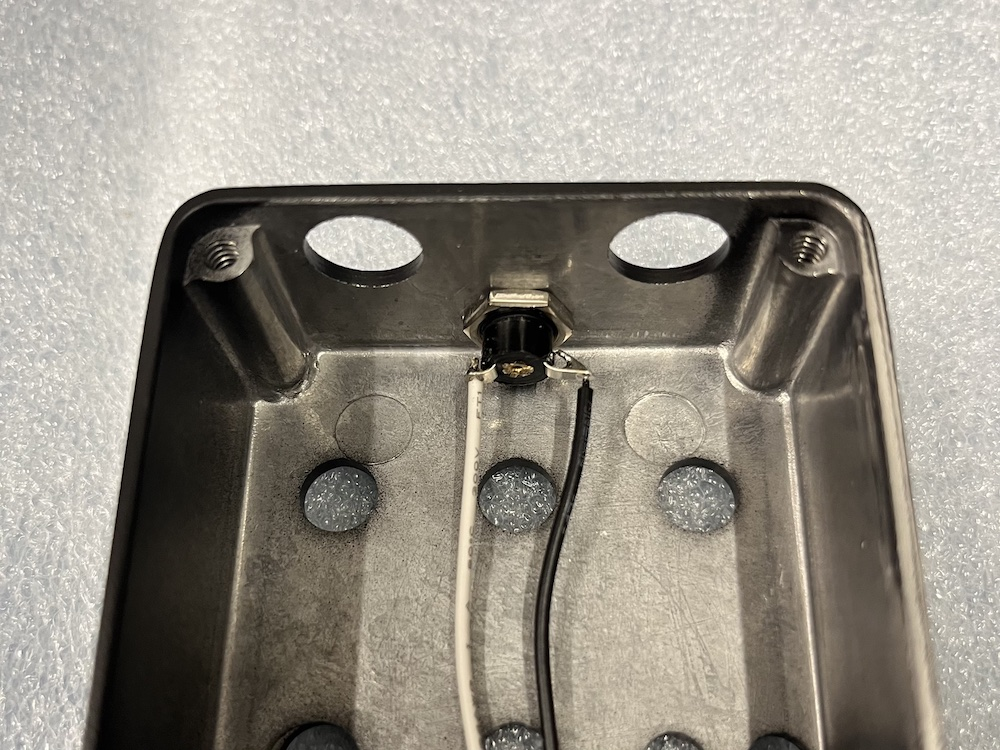

# THT Parts
## Parts for PCB:
- 2x JST connectors [P1, SW3]
- 1x EC2-5SNU/5SNJ relay [RLY1]
- 1x short wire [P9](for ground to jacks) 
- 2x long wires [P2, P5] (for signal to jacks)
  - use small rectangular pads on the JST-style footprints.

## Controls, etc:
- Black DC jack w/ harness
  - bend pins outward before adding harness, otherwise 100kB pot won’t fit.
  - connect harness to [P1] JST connector.
- 1x 25kB pot [RV2]
- 1x 100kB pot [RV4]
- 3x 100kA pot [RV1, RV3, RV5]
- 1x SPST ON-OFF-ON toggle [SW1]
- 1x DPDT ON-ON toggle [SW2]
- 1x LED yellow [D2]
  - long leg to square pad (hole).
- 1x SPST NO footswitch w/ harness
  - connect harness to [SW3] JST connector.

# Step by Step
### it's best to start with an empty enclosure:

### first, insert the DC jack. then add the nut and tighten it so the jack remains in place.

### next, use a pair of pliers to bend the solder lugs outwards. the lug is the bit of metal with a hole in it, designed for a wire to fit through.
### it works best to grab the solder lug close to the jack. bend it at a sharp angle so it remains straight after the bend.

### last, solder the connector wire to the jack.
### on the current version, solder the black wire to the longer solder lug.

### done.
