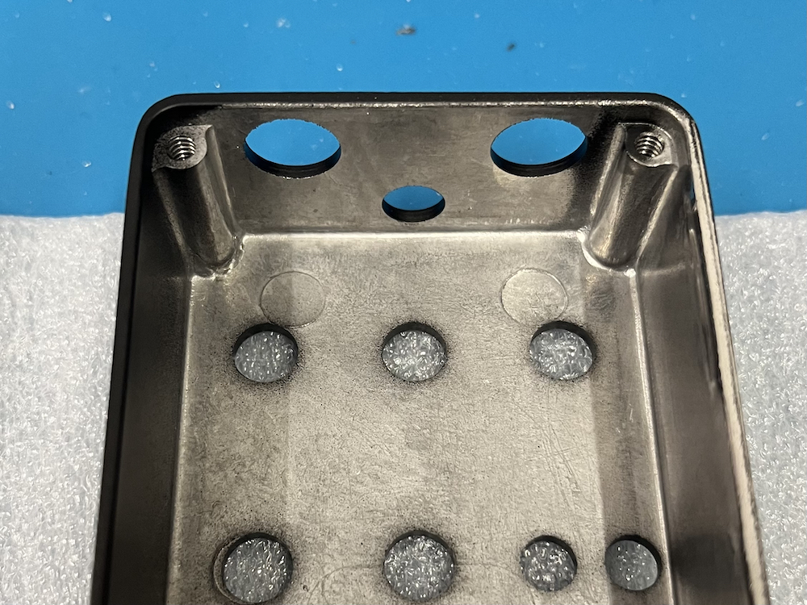
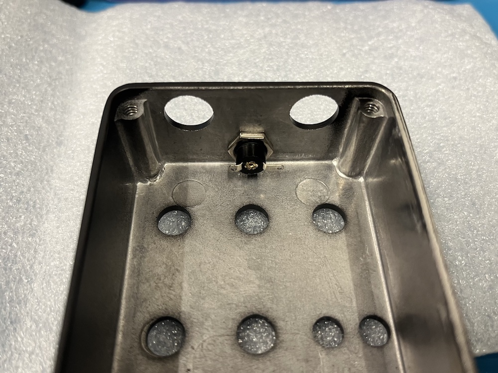

# Step by Step
### it's best to start with an empty enclosure:

### first, insert the DC jack. then add the nut and tighten it so the jack remains in place.

### next, use a pair of pliers to bend the solder lugs outwards. the lug is the bit of metal with a hole in it, designed for a wire to fit through.
### it works best to grab the solder lug close to the jack. bend it at a sharp angle so it remains straight after the bend.

### last, solder the connector wire to the jack.
### on the current version, solder the black wire to the longer solder lug.

### done.
